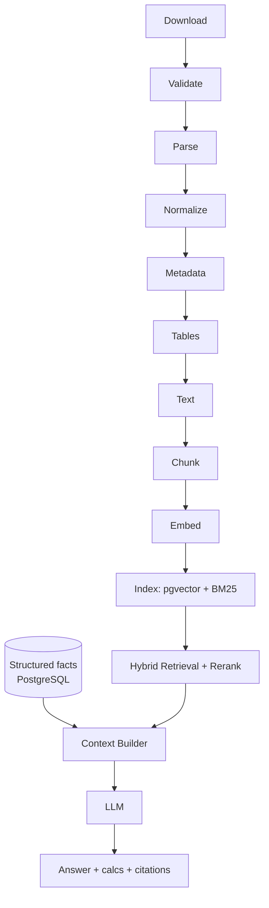

# Reliance Earnings Intelligence RAG

MIT licensed — see [LICENSE](LICENSE).

A financial-document RAG system for **Reliance Industries Ltd. (NSE: RELIANCE)** that combines
**structured financial facts** (database) with **unstructured-document RAG** (commentary, explanations,
guidance) — with hybrid retrieval, a calculation engine, and page-level citations.

> Status: **Milestones 1-9 complete** — ingestion, structured facts, chunking/BM25,
> hybrid retrieval with citations, calculation engine, grounded answers, Streamlit
> UI, measured evaluation (**26/26 pass**), and final hardening. This is a finished
> portfolio project: correct on the Q1 FY27 seed set, extensible by design.

## 1. Problem

Quarterly earnings research means juggling three things at once: the reported numbers (often in
XBRL/HTML filings), management's narrative (media releases, presentations, transcripts), and the
analyst's own math (growth rates, margins, segment contributions). Ordinary "chat with PDF" RAG
fails here because it:

- dumps numbers into vectors where they can't be computed on reliably,
- mixes standalone and consolidated figures silently,
- returns answers without page-level provenance,
- lets the LLM do arithmetic it shouldn't be trusted with.

## 2. Architecture

```
                User
                  |
                  v
            Query Router
                  |
      +-----------+-----------+
      |                       |
      v                       v
Structured Data           RAG Retrieval
PostgreSQL              Vector DB (pgvector)
facts + calcs           Unstructured text
      |                       |
      |                 +-----+------+
      |                 |            |
      |              Semantic       BM25
      |                 |            |
      |                 +-----+------+
      |                       |
      +-----------+-----------+
                  |
                  v
            Context Builder
                  |
                  v
                 LLM
                  |
                  v
         Answer + Calculations
          + Source Citations
```

Golden rules:

- **Numbers live in the database.** The vector DB never holds authoritative financial figures.
- **RAG holds narrative**: management commentary, explanations, developments, guidance, analyst Q&A.
- **Calculations are Python**, never LLM arithmetic (YoY/QoQ, margins, CAGR, pp-change, …).
- **Standalone vs consolidated is never mixed**; every structured query declares its basis
  (default: consolidated).
- **Every factual claim carries a citation** with a real page / source location.



## 3. Repository layout

```
reliance-earnings-rag/
├── app/
│   ├── api/            # placeholder for a future route split (routes live in main.py)
│   ├── ingestion/      # M1+M7: download/validate/hash/registry/manifest (+ specs, uploads)
│   ├── extraction/     # M2: PDF/XBRL parsing, tables, metadata
│   ├── retrieval/      # M3-4: chunking, embeddings, BM25, hybrid fusion, citations,
│   │                   #   context packs, retriever factory
│   ├── financial/      # M5: calculation engine + structured fact access
│   ├── llm/            # M6: provider abstraction, query router, answer gen
│   ├── evaluation/     # M8: dataset.json + measured scoring (recall/citation/numeric)
│   ├── models/         # Pydantic contracts + SQLAlchemy schema (documents, facts, chunks)
│   └── config.py       # env-driven settings
├── data/
│   ├── raw/reliance/   # downloaded originals (git-ignored)
│   ├── processed/      # registry + manifest + SQLite fallback + BM25 pickle + eval report
│   └── extracted/      # per-document parse artifacts (M2+)
├── scripts/            # ingest / extract / index / run_eval (+ CLI entry points)
├── tests/              # 67 tests, one file per milestone
├── main.py             # FastAPI: /health /documents /facts /search /calc /ask
├── streamlit_app.py    # Streamlit Q&A UI (M7): upload → ingest → ask with sources
├── requirements.txt    # pinned to M9-verified versions
├── docker-compose.yml  # postgres + pgvector (production cutover)
└── .env.example
```

## 4. Data pipeline (M1)

```
download → validate → hash → register → manifest
```

- **Download** with a browser user-agent (NSE blocks bare clients), streaming + retries.
- **Validate**: existence, per-file minimum bytes, magic bytes (`%PDF` vs `<html`). A block
  page or truncated response can never enter the registry.
- **Hash** (SHA256 of file bytes) is the document identity.
- **Registry** (`data/processed/registry.json`, keyed by hash) makes ingestion **idempotent**:
  re-ingesting the same bytes returns the existing record; no duplicates ever.
- **Manifest** (`data/processed/manifest.json`) lists filename, document type, quarter,
  reporting basis, source URL, SHA256, and file size.

Seed dataset (Q1 FY27):

| file | type | basis |
|---|---|---|
| `NSE_Q1FY27_standalone_xbrl.html` | xbrl | standalone |
| `NSE_Q1FY27_consolidated_xbrl.html` | xbrl | consolidated |
| `RIL_Q1FY27_media_release.pdf` | media_release | consolidated |

Reporting basis is **explicit in code** (`app/ingestion/documents.py`), never inferred from
filenames — the two NSE URLs differ by a single ID segment. As a guardrail, the extractor
reads the basis each filing *states about itself* (`parse_xbrl().stated_report_basis`) and
refuses to load a document whose stated basis contradicts the spec.

## 5. Structured extraction + financial database (M2)

```
parse (XBRL tables / PDF pages) → map to canonical metrics → upsert DB
```

- **XBRL** (`app/extraction/xbrl.py`): the NSE filings are plain-HTML renderings (9 tables,
  no inline ix: tags). Table 1 (P&L) and table 4 (segments) map to canonical metrics;
  amounts are stated **in Rs Lakhs** and converted to canonical **INR crore** (/100).
  EPS/ratios keep their own units. Parenthesised negatives, Indian digit grouping, and
  near-miss rows (e.g. the *regulatory deferral* row mentions "deferred tax" without being
  the tax line) are handled with explicit exclusion rules.
- **PDF** (`app/extraction/pdf.py`): 34 pages with real page numbers + printed labels
  ("Page X of 20" body, "Page Y of 14" annexure) and font-size headings. `find_tables`
  proved unreliable (merged cells), so the annexure's rigid *label-then-values* text
  layout parses deterministically instead. The annexure holds **both consolidated and
  standalone** statements — the parser tracks basis-title lines so standalone values can
  never overwrite consolidated ones (this bug was caught by the conflict guard during
  development). Pages with <200 characters are flagged `needs_ocr` rather than accepted.
- **Database** (`app/models/database.py`, `app/financial/query.py`): SQLAlchemy
  `documents` + `financial_facts` tables — identical schema on PostgreSQL (production,
  via `DATABASE_URL`) and a local SQLite fallback (`data/processed/reliance_earnings.db`)
  so development works without Docker. Upserts are idempotent; same-identity value
  conflicts are kept-first with a loud warning instead of silent overwrites.
- **Coverage**: 644 facts — full P&L per basis, per-segment revenue/EBITDA/EBIT/assets/
  liabilities, OCI, capital, ratios, plus annexure-only comparatives
  (**Q4 FY26**, **Q1 FY26**, **FY26**) that seed future YoY/QoQ reasoning. XBRL↔annexure
  agreement is enforced by test: 44 multi-source metrics, 0 mismatches.
- **Absent by design** (nullable, never fabricated): `total_debt` (only ratios disclosed),
  `total_equity` (`net_worth` stored instead), company EBITDA (arrives with M5).
- Per-document JSON artifacts (parsed meta + facts) land in `data/extracted/`.

## 6. Chunking + embeddings + BM25 (M3)

```
chunk (pages/sections/tables) -> embed -> LocalVectorStore + BM25 pickle
```

- **Chunks** (`app/retrieval/chunking.py`, `app/models/chunk.py`): 84 total — page-aware
  with section headings, deterministic ids, `text`/`table`/`descriptor` types kept
  separate. Tables are never merged into prose. Boilerplate headers are stripped.
- **Numbers stay out of vectors**: XBRL tables are skipped entirely (all facts in DB);
  annexure data rows are skipped (verified: zero data-token leaks on "of 14" pages).
  Body narrative keeps its numbers — subsidiary KPIs (Jio, Retail) exist nowhere else.
- **Embeddings** (`app/retrieval/embeddings.py`): `all-MiniLM-L6-v2`, 384 dims
  (matches `PGVECTOR_DIM`), row-normalized, stored as float32 BLOBs. A hash-based
  provider covers offline unit tests.
- **Stores** (`app/retrieval/vector_store.py`, `bm25.py`): `LocalVectorStore`
  (SQLite metadata filter in SQL *before* numpy cosine scoring) + `BM25Okapi` index
  (`data/processed/bm25_index.pkl`, rebuilt on corpus change). Same `chunks` schema
  will back pgvector in production — no call-site changes.
- **Boundaries** (`interfaces.py`, `retrievers.py`, `app/llm/providers.py`):
  `EmbeddingProvider` / `Retriever` / `Reranker` / `LLMProvider` protocols with
  `SemanticRetriever`, `BM25Retriever`, and a `PassthroughReranker` placeholder.
- Sanity: "Jio Platforms revenue growth" → Jio chunks (0.70); "KGD6 production" and
  retail KPIs surface on both paths; metadata filters (`quarter=Q9` → empty) enforced.

## 7. Hybrid retrieval + citations (M4)

```
semantic + BM25  →  RRF fusion  →  rerank  →  chunks + citations ─┐
structured facts (explicit requests) ──→ fact citations ─────────┴→ ContextPack
```

- **Fusion** (`app/retrieval/hybrid.py`): Reciprocal Rank Fusion (`1/(60+rank)`) over
  both paths with identical metadata filters, dedupe by chunk id, deterministic
  ordering. The `Reranker` protocol refines the fused list (passthrough today; a
  learned rerank slots in without touching callers).
- **Citations** (`app/retrieval/citations.py`): `[Q1 FY27 Media Release, p. 6]` for PDF
  chunks (real page numbers), `[NSE Q1 FY27 Consolidated XBRL]` for filings (pages
  never invented), `[Q1 FY27 Media Release annexure, p. 21]` for annexure facts with
  the page recovered from stored provenance. Deduped, indexed, rendered as a
  "Sources used" block. Citations name *sources* — M6 decides whether each claim is a
  reported fact, a calculation, or a management statement.
- **Context builder** (`app/retrieval/context.py`): `ContextPack(query, chunks, facts,
  citations)` — the exact object M6's router + LLM will consume; fact attachment is
  explicit (`fact_requests`), so standalone/consolidated isolation holds end to end.

## 8. Calculation engine (M5)

```
DB facts → basis guard → pure math → CalcResult(value + inputs + sources)
```

- **Pure functions** (`app/financial/calculations.py`): YoY/QoQ growth, margins, CAGR,
  absolute change, percentage-point change, segment share, guidance-vs-actual. Undefined
  results (missing input, zero divisor) return `None` — never zero, never fabricated.
- **Engine** (`app/financial/engine.py`): resolves facts, enforces the
  standalone/consolidated guard (`MixedBasisError` unless `allow_mixed=True` for an
  explicit comparison, labelled `basis="mixed:..."`), and attaches both inputs and
  source locations to every result — e.g. consolidated revenue YoY Q1 FY27:
  **25.41%** from `{311850.0, 248660.0}`.
- Verified: O2C EBIT margin 7.02%, Retail EBITDA margin 6.98%, O2C revenue share
  64.71%, operating-margin pp change −1.1pp, all with provenance. `/calc` exposes
  every op over HTTP.

## 9. Query routing + answers (M6)

```
question → route (8 classes + slots) → facts + calcs + hybrid context → answer
```

- **Router** (`app/llm/router.py`): deterministic keyword classifier — exact on all
  five spec examples (fact/calc/qualitative/segment/guidance) plus cross-quarter
  detection, segment/metric/period slots, and standalone-vs-consolidated basis
  (default consolidated). An LLM classifier can replace `route()` behind its type.
- **Providers** (`app/llm/providers.py`): `OpenAIProvider`/`AnthropicProvider` over
  httpx (no SDK deps), selected by `LLM_PROVIDER`; `get_llm_provider()` returns None
  without keys, and the system runs fully offline in template mode.
- **Answers** (`app/llm/answers.py`): reported facts with citations, engine
  calculations with inputs, and extractive management-commentary quotes — sections
  kept distinct per spec §14-15. Missing data yields an honest "I don't have…",
  never a guess. The LLM path uses a strict grounding prompt (supplied numbers
  only, cite every claim, state basis) with template fallback on failure.
- `/ask?q=…` serves route + mode + basis + answer + calculations JSON.
  Cross-basis questions ("standalone vs consolidated") return both bases side by
  side, each labelled — blending is still refused everywhere else.

## 10. Streamlit UI (M7)

Sidebar: PDF/XBRL-HTML upload with company, quarter, document-type, and reporting-basis
selectors → idempotent ingest (`register_local_file`, same hash identity as M1) →
one-click extract + index. Question scope (Auto/consolidated/standalone — a manual
choice is prepended to the question transparently), retrieval method, and top-k.
Main: example prompts, answer with route/mode/basis, calculation expander (values +
inputs JSON), retrieved-chunks expander (scores + provenance), and the indexed-documents
table. Errors surface inline; the app never crashes on a bad upload or question.
`streamlit run streamlit_app.py` (verified headless: health + home HTTP 200).

## 11. Installation

Prerequisites: Python 3.11+, pip. PostgreSQL + pgvector only needed from Milestone 2+
(`docker compose up -d` provides it via `pgvector/pgvector:pg16`).

```powershell
cd reliance-earnings-rag
python -m venv .venv
.venv\Scripts\Activate.ps1
pip install -r requirements.txt
copy .env.example .env
```

## 12. Running (Milestones 1-9)

```powershell
# Ingest the three Q1 FY27 documents + write the manifest
python scripts/ingest_q1fy27.py

# Parse into the structured fact database (PostgreSQL if DATABASE_URL works,
# otherwise local SQLite fallback at data/processed/reliance_earnings.db)
python scripts/extract_q1fy27.py

# Chunk + embed + build BM25 (needs HF access once for all-MiniLM-L6-v2)
python scripts/index_q1fy27.py

# Run tests (67 across 8 test files)
pytest -q

# Backend (health + manifest + structured facts + narrative search w/ citations)
python main.py            # → /health , /documents , /facts?metric=revenue_from_operations&period=Q1%20FY27
                         #   /search?q=Jio%20revenue&method=hybrid
                         #   /calc?op=yoy&metric=revenue_from_operations&current=Q1%20FY27&prior=Q1%20FY26
                         #   /ask?q=What%20was%20revenue%20growth%20YoY%3F

streamlit run streamlit_app.py   # M7 Q&A UI
```

## 13. Example questions

- "What was consolidated revenue in Q1 FY27?" → FINANCIAL_FACT
- "What was revenue growth YoY?" → CALCULATION
- "Why did margins decline?" → QUALITATIVE
- "Compare Jio and Retail revenue growth." → SEGMENT_ANALYSIS
- "What did management say about capex?" → GUIDANCE / QUALITATIVE

Answers will separate **reported facts**, **calculated values**, and **management statements**,
each with citations like `[Q1 FY27 Media Release, p. 4]` or `[NSE Q1 FY27 Consolidated XBRL]`.

## 14. Evaluation (M8)

`app/evaluation/dataset.json` holds **26 questions** covering direct facts, YoY/QoQ,
margins, segment analysis, commentary, citations, ambiguity, standalone-vs-consolidated
isolation *and explicit comparison* (B2), honest-absence, and cross-quarter reasoning —
each with machine-checkable expectations (facts + tolerances, keywords, citation
substrings, text snippets, scoped absences). `python scripts/run_eval.py` measures
retrieval recall, citation accuracy, numerical accuracy, and answer correctness,
saving `data/processed/eval_report.json`:

> **Measured 2026-09-25 (template mode, Q1 FY27 seed set): 26/26 pass —
> recall 1.000, citation 1.000, numeric 1.000, correctness 1.000.**

Two calibration notes, kept visible rather than hidden: segment-fact expectations
carry explicit `segment` keys (company vs segment granularity is a real distinction),
and `absent_*` checks scope to the facts/calculations sections because quoted
commentary carries its own citations.

## 15. Hardening (M9)

- `requirements.txt` pinned to the verified environment; unused imports removed;
  `.env.example` covers retrieval settings; derived artifacts git-ignored.
- No secrets in the repo (audited); no claimed scores beyond the measured eval report.
- Eval grew to **26 questions** with B2 (explicit cross-basis comparison).
- Full suite: **67 tests, all passing**; eval CLI green at **26/26**.


## 16. Limitations (current)

- Single-quarter seed (Q1 FY27 + annexure comparatives). Multi-quarter ingestion is
  designed for, not yet loaded.
- Scores above are measured on the seed set in template mode — evidence the pipeline
  is sound, not a claim about open-ended QA quality. LLM-answer quality is unmeasured
  (no key in this environment).
- The reranker is a passthrough until a harder (multi-quarter, LLM-judged) eval
  justifies a learned one.
- Requires network access to `nsearchives.nseindia.com` and `ril.com` (M1 only; M2+ runs offline).
- SQLite fallback is a dev convenience; production should set `DATABASE_URL` to the
  `docker compose up -d` PostgreSQL (`pip install "psycopg[binary]"`).
- No OCR engine wired yet — scanned pages would be flagged `needs_ocr`, not parsed.
- Narrative numbers in the media-release body (e.g. JPL/RRVL subsidiary KPIs) are
  deliberately NOT extracted as structured facts; they belong to RAG (M3-M4).

## 17. Future improvements

Multi-quarter ingestion (Q4 FY25–Q4 FY26 + transcripts/presentations), learned
rerank, LLM-judged eval with an API key, Postgres/pgvector production cutover,
auth + rate limits, `app/api/` route split once the surface grows.
